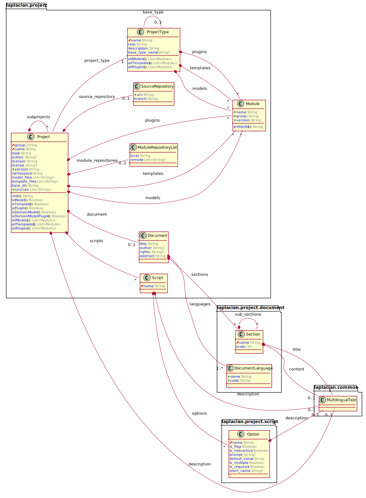

# model.project

A model which expresses the logical structure of laplacian-based projects and modules.


<!-- @main-content@ -->
<!-- @main-content@ -->

## Model overview

The following diagram summarizes the structure of the model:



## Entities
### [Module](./doc/entities/Module.md)

module

### [Project](./doc/entities/Project.md)

project

### [SourceRepository](./doc/entities/SourceRepository.md)

source_repository


## Usage

Add the following entry to your project definition.

```yaml
project:
  models:
  - group: laplacian
    name: model.project
    version: 1.0.0
```