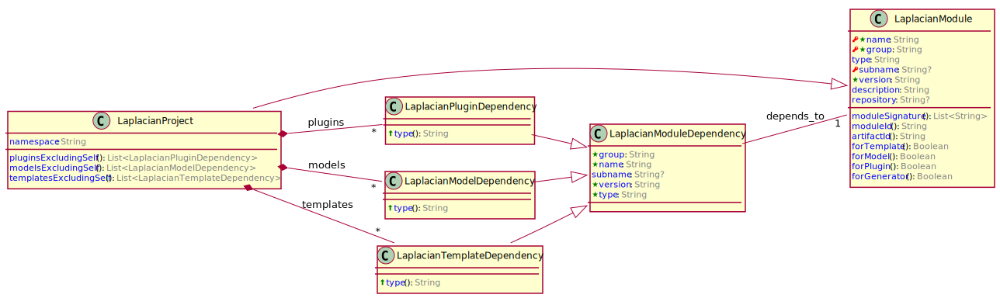

<!-- @head-content@ -->
# laplacian/project.domain-model

该模型代表了*Laplacian*项目的逻辑结构。


*Read this in other languages*: [[English](README.md)] [[日本語](README_ja.md)]
<!-- @head-content@ -->

<!-- @toc@ -->
## Table of contents
- [概述](#概述)

  * [模式概述](#模式概述)

- [如何使用](#如何使用)

- [索引](#索引)

  * [实体清单](#实体清单)

  * [命令列表](#命令列表)

  * [源码列表](#源码列表)


<!-- @toc@ -->

<!-- @main-content@ -->
## 概述


### 模式概述


下面的图表显示了本模块所包含的每个实体的内容以及它们之间的关系。


## 如何使用

要应用此model模块，请在项目定义中加入以下条目

```yaml
project:
  models:
  - group: laplacian
    name: project.domain-model
    version: 1.0.0
```

您可以运行以下命令查看受本模块应用影响的资源列表及其内容

```console
$ ./script/generate --dry-run

diff --color -r PROJECT_HOME/.NEXT/somewhere/something.md PROJECT_HOME/somewhere/something.md
1,26c1,10
< content: OLD CONTENT
---
> content: NEW CONTENT
```

如果没有问题，请执行下面的命令来反映变化

```console
$ ./script/generate

```


## 索引


### 实体清单


- [**Document**](<./doc/entities/Document.md>)
document
- [**Section**](<./doc/entities/Section.md>)
section
- [**Module**](<./doc/entities/Module.md>)
module
- [**Project**](<./doc/entities/Project.md>)
project
- [**ProjectType**](<./doc/entities/ProjectType.md>)
project_type
- [**Script**](<./doc/entities/Script.md>)
script
- [**Option**](<./doc/entities/Option.md>)
option
- [**SourceRepository**](<./doc/entities/SourceRepository.md>)
source_repository
### 命令列表


- [./script/do-each-subproject.sh](<./scripts/do-each-subproject.sh>)

  为每个子项目执行参数指定的命令。

  例子:
  ```console
  $ ./scripts/null -c git status
  ```

  > Usage: do-each-subproject.sh [OPTION]...
  >
  > -h, --help
  >
  >   显示如何使用此命令。
  >   
  > -v, --verbose
  >
  >   显示更详细的命令执行信息。
  >   
  > -c, --continue-on-error
  >
  >   即使给定的命令在中间的一个子项目中失败，对其余的子项目执行该命令。
  >   
- [./script/generate-laplacian-project-domain-model-plugin.sh](<./scripts/generate-laplacian-project-domain-model-plugin.sh>)

  在下面的目录中生成[laplacian/project.domain-model-plugin](<null>)项目，作为子项目。
  ```
  subprojects/laplacian.project.domain-model-plugin
  ```
  如果子项目已经存在，则更新子项目的内容。

  > Usage: generate-laplacian-project-domain-model-plugin.sh [OPTION]...
  >
  > -h, --help
  >
  >   显示如何使用此命令。
  >   
  > -v, --verbose
  >
  >   显示更详细的命令执行信息。
  >   
  > -c, --clean
  >
  >   删除子项目的所有本地资源，并对其进行再生。
  >   
- [./script/generate.sh](<./scripts/generate.sh>)

  生成本项目中每个`src/` `model/` `template/`目录下的资源。
  结果反映在`dest/` `doc/` `script/`的每个目录中。

  *生成器输入文件*

  - `src/`
    存储未被生成器处理的静态资源。
    这个目录的内容直接复制到`dest/`目录中。

  - `model/`
    存储以 *YAML* 或 *JSON* 格式编写的静态模型数据文件，用于生成。

  - `template/`
    这个目录中包含了用于生成的模板文件。
    扩展名为`.hbs`的文件将作为模板处理。所有其他文件都会被复制。

    - `template/dest` `template/doc` `template/scripts`
      这些目录中的每一个目录都包含要输出的资源的模板文件，其目录为 `dest/`doc/`scripts`。

    - `template/model` `template/template`
      这些目录存储模板文件，更新生成过程中使用的`template/`和`model/`的内容。
      如果在生成过程中更新了 `template/` `model/` 的内容，则生成过程将递归执行。
      在上述过程中发生的对 `template/` `model/` 的变化被视为中间状态，并在过程完成后丢失。
      使用 *--dry-run* 选项来检查这些中间文件。

  *生成器输出文件*

  - `dest/`
    输出作为生成过程的结果的应用程序和模块的源文件。

  - `doc/`
    输出项目文件。

  - `scripts/`
    输出开发和操作中使用的各种脚本。

  > Usage: generate.sh [OPTION]...
  >
  > -h, --help
  >
  >   显示如何使用此命令。
  >   
  > -v, --verbose
  >
  >   显示更详细的命令执行信息。
  >   
  > -d, --dry-run
  >
  >   该命令处理完毕后，生成的文件将被输出到`.NEXT`目录下。
  >   不反映到`dest/`doc/`doc/`scripts/`文件夹中。
  >   此外，`.NEXT`目录的内容与当前文件之间的差异。
  >   这个目录还包含了在生成过程中创建的任何中间文件。
  >   
  > -r, --max-recursion [VALUE]
  >
  >   当`model/` `template/`目录的内容在生成过程中被更新时，递归执行的次数上限。
  >    (Default: 10)
- [./script/publish-local.sh](<./scripts/publish-local.sh>)

  项目中的资源生成后，在`./dest`目录下的资源作为模型模块建立，并在本地资源库中注册。

  > Usage: publish-local.sh [OPTION]...
  >
  > -h, --help
  >
  >   显示如何使用此命令。
  >   
  > -v, --verbose
  >
  >   显示更详细的命令执行信息。
  >   
  > -r, --max-recursion [VALUE]
  >
  >   这个选项与[generate.sh](<./scripts/generate.sh>)中的同名选项相同。
  >    (Default: 10)
  > , --skip-generation
  >
  >   这个选项与[generate.sh](<./scripts/generate.sh>)中的同名选项相同。
  >   
- [./script/publish-local-laplacian-project-domain-model-plugin.sh](<./scripts/publish-local-laplacian-project-domain-model-plugin.sh>)

  为[laplacian/project.domain-model-plugin](<null>)子项目生成资源。

  > Usage: publish-local-laplacian-project-domain-model-plugin.sh [OPTION]...
  >
  > -h, --help
  >
  >   显示如何使用此命令。
  >   
  > -v, --verbose
  >
  >   显示更详细的命令执行信息。
  >   
### 源码列表


- [model/project.yaml](<./model/project.yaml>)
- [src/entities/document/section.yaml](<./src/entities/document/section.yaml>)
- [src/entities/document.yaml](<./src/entities/document.yaml>)
- [src/entities/module.yaml](<./src/entities/module.yaml>)
- [src/entities/project/examples.yaml](<./src/entities/project/examples.yaml>)
- [src/entities/project_type.yaml](<./src/entities/project_type.yaml>)
- [src/entities/project.yml](<./src/entities/project.yml>)
- [src/entities/script/option.yaml](<./src/entities/script/option.yaml>)
- [src/entities/script.yaml](<./src/entities/script.yaml>)
- [src/entities/source_repository.yaml](<./src/entities/source_repository.yaml>)


<!-- @main-content@ -->